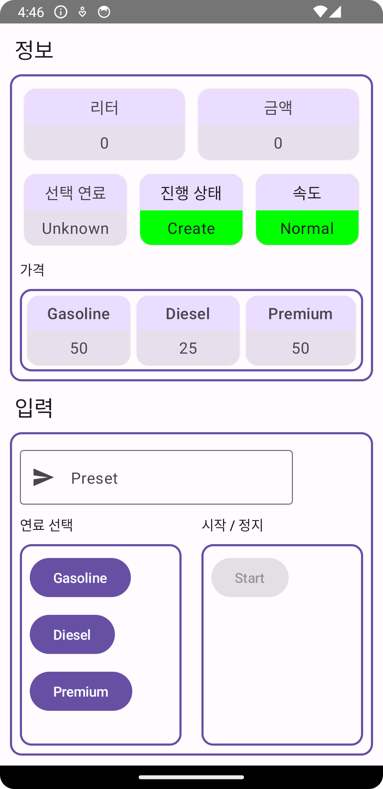
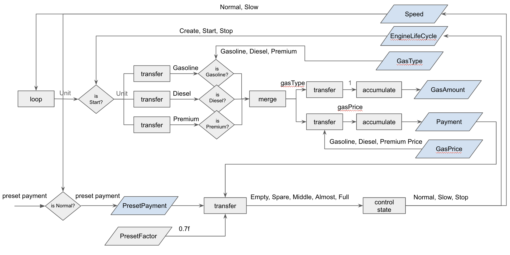
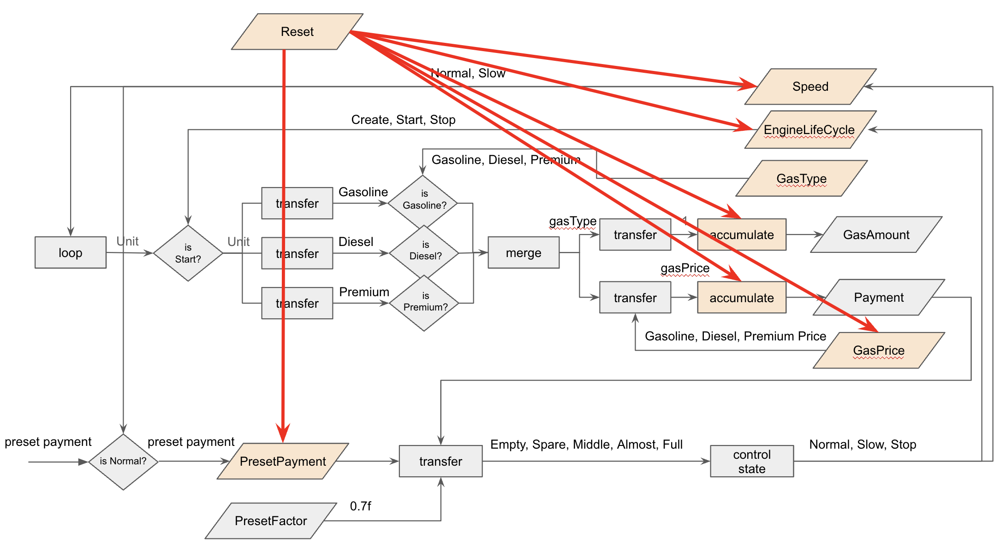
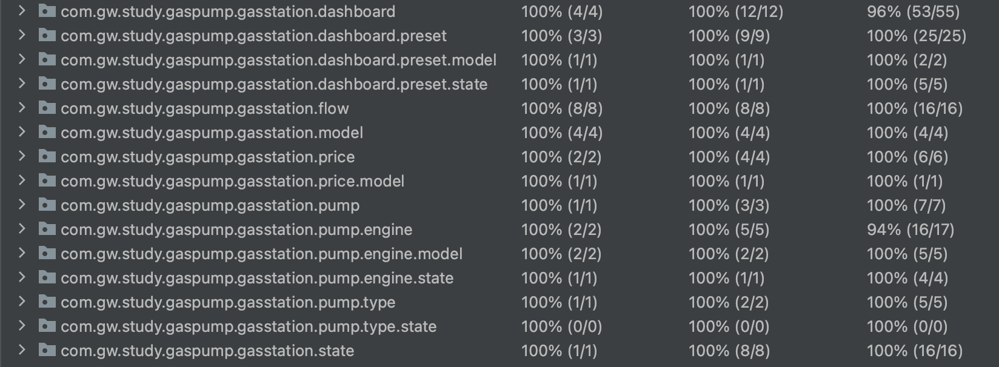
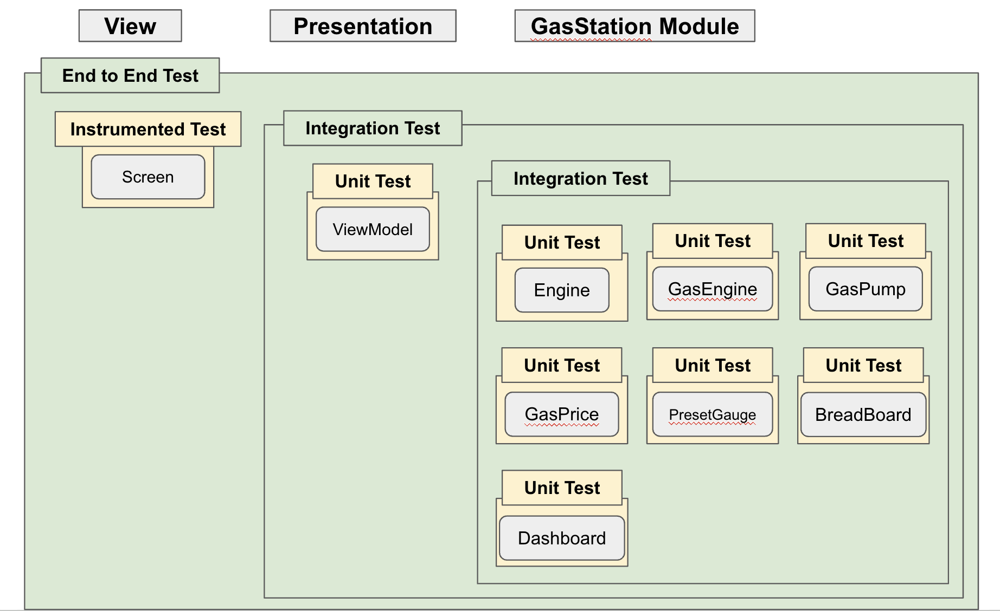
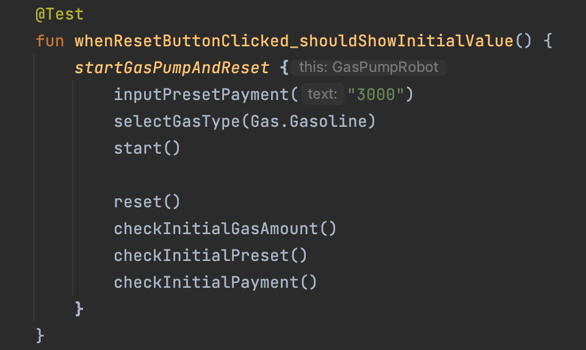

# GasPump Project

GasPump Project 는 주유소의 주유 기능을 FRP, TDD 기반으로 개발 되었습니다.

Project showcases:

* 컴포즈 기반 UI
* Android Architecture Components: ViewModel
* Hilt
* FRP (Functional Reactive Programing) 스타일
* 테스트 주도 개발 (Test Driven Development)
* Unit 테스트, 컴포즈 UI 테스트, Integration 테스트
* Robot Pattern 기반 End to End 테스트
* 컴포즈 테스트 with IdlingResource

## Screenshots

## Features

### 컴포즈 기반 UI
[GasPumpScreen](app/src/main/java/com/gw/study/gaspump/ui/screen/GasPumpScreen.kt) 컴포저블 함수는 [GasPumpUiState](app/src/main/java/com/gw/study/gaspump/ui/screen/GasPumpUiState.kt) 를 사용 하여 화면에 데이터를 노출 합니다.

### Android Architecture Components
Presentation Layer 에 [BaseViewModel](app/src/main/java/com/gw/study/gaspump/ui/architecture/viewmodel/BaseViewModel.kt) 을 상속 하여, [GasPumpViewModel](app/src/main/java/com/gw/study/gaspump/ui/screen/GasPumpViewModel.kt) 을 사용 합니다.

### Hilt
[GasStationModule](app/src/main/java/com/gw/study/gaspump/di/GasStationModule.kt) 에서 GasStation 의존성을 관리 합니다. 컴포즈 테스트 진행 시 [IdlingResource](https://developer.android.com/reference/kotlin/androidx/compose/ui/test/IdlingResource) 의존성으로 인해 [GasEngineModule](app/src/main/java/com/gw/study/gaspump/di/GasEngineModule.kt) 이 정의 되었습니다.  

### FRP (Functional Reactive Programing)
다음 플로우 차트를 기반하여 개발 되었습니다.

### 테스트 주도 개발 (Test Driven Development)
테스트 주도 개발 기반으로 개발 되었습니다.

### Unit 테스트, 컴포즈 UI 테스트, Integration 테스트
JUnit4, Mockito 를 사용하여 테스트가 진행 되었습니다.

테스트 개요

[GasStation Module Test](gasstation/src/test/java/com/gw/study/gaspump/gasstation) 에서 모든 테스트 케이스를 확인 할 수 있습니다.
#### [GasPumpDashboardTests](gasstation/src/test/java/com/gw/study/gaspump/gasstation/dashboard/GasPumpDashboardTests.kt)
TDD 기반 Dashboard 테스트 입니다. Mockito 를 사용하여 Dashboard 가 고립된 상태로 테스트가 가능 할 수 있게 하였습니다.

#### [GasPumpDashboardIntegrationTests](gasstation/src/test/java/com/gw/study/gaspump/gasstation/dashboard/GasPumpDashboardIntegrationTests.kt)
GasStation 통합 테스트 입니다. 실제 의존하는 객체 기반으로 테스트 시나리오가 진행 되었습니다.

#### [ResetFlowTest](gasstation/src/test/java/com/gw/study/gaspump/gasstation/flow/ResetFlowTest.kt)
Flow 와 channelFlow 를 연계 하여 개발 한 커스텀 ResetFlow 테스트 입니다. 

[ViewModel Test](app/src/test/java/com/gw/study/gaspump/ui/screen) 에서 자세한 확인 가능 합니다.
#### [GasPumpViewModelIntegrationTests](app/src/test/java/com/gw/study/gaspump/ui/screen/integration/GasPumpViewModelIntegrationTests.kt)
ViewModel 통합 테스트로 gasStation 모듈과 함께 테스트 되었습니다.

[Compose Ui Test](app/src/androidTest/java/com/gw/study/gaspump/ui/screen) 에서 모든 테스트 케이스를 확인 할 수 있습니다.
#### [GasPumpScreenTests](app/src/androidTest/java/com/gw/study/gaspump/ui/screen/GasPumpScreenTests.kt)
TDD 기반 Compose Ui 테스트 입니다. dexmaker-mockito-inline을 사용하여 Screen Ui 가 고립된 상태로 테스트가 가능 할 수 있게 하였습니다.

### Robot Pattern 기반 End to End 테스트
UI 테스트에 대한 상세한 구현 위주가 아닌, 어떻게 진행 되는지에 대해 기술 함으로써, 테스트의 이해도를 높였습니다.

테스트 코드

테스트 실행

[GasPumpScreenEndToEndResetTests](app/src/androidTest/java/com/gw/study/gaspump/ui/screen/GasPumpScreenEndToEndResetTests.kt) 에서 자세히 확인 할 수 있습니다.

### Compose 테스트 with IdlingResource
시작, 정지, 리셋 관련 테스트 진행 시 백그라운드 작업 동기화를 위해 컴포즈 커스텀 [CountingIdlingResource](app/src/androidTest/java/com/gw/study/gaspump/idlingresource/CountingIdlingResource.kt) 과 [UriIdlingResource](app/src/androidTest/java/com/gw/study/gaspump/idlingresource/UriIdlingResource.kt) 을 사용 하였습니다.

#### [DecoratedEngine](app/src/androidTest/java/com/gw/study/gaspump/gasstation/pump/engine/DecoratedEngine.kt)
[CountingIdlingResource](app/src/androidTest/java/com/gw/study/gaspump/idlingresource/CountingIdlingResource.kt) 를 Engine 에 Decorate 하여 테스트를 진행 하였습니다.